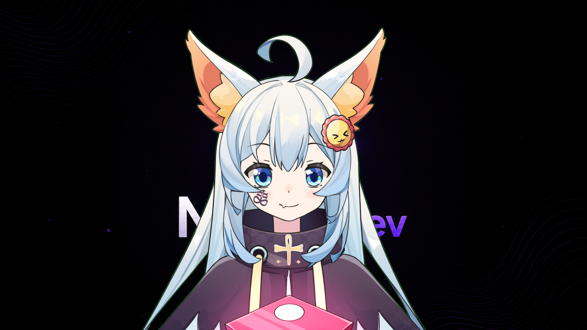

<div align="center">
          
# HOPE

### Assistente de IA com personalidade de VTuber

Uma assistente virtual criada em Python para conversar em português, responder por voz e interagir em tempo real com um avatar no VTube Studio.

<br>



<br><br>

[▶️ Assistir à demonstração da HOPE]

https://github.com/user-attachments/assets/c2c32f76-7a0b-46ad-8079-555e8ec7fc11
<div align="center">

</div>

---

## Sobre o projeto

A **HOPE** nasceu com a proposta de transformar uma assistente de inteligência artificial em uma presença mais viva, expressiva e interativa.

Em vez de apenas gerar respostas em texto, ela combina inteligência artificial local, reconhecimento de voz, síntese de fala e controle de expressões para conversar por meio de um avatar no **VTube Studio**.

A assistente é capaz de ouvir o usuário, interpretar a mensagem, formular uma resposta com personalidade própria, falar em voz alta e reagir visualmente durante a conversa.

## Como a HOPE funciona

O usuário pode interagir com a assistente por texto ou pelo microfone.

A mensagem é processada junto ao histórico recente da conversa e ao prompt responsável por definir a personalidade da personagem. Em seguida, um modelo de linguagem executado localmente pelo **Ollama** gera a resposta.

O texto produzido é transformado em áudio por um sistema de síntese de voz. Ao mesmo tempo, a HOPE identifica o contexto emocional da resposta e ativa expressões configuradas no VTube Studio.

```text
Usuário fala ou digita
          ↓
Reconhecimento da mensagem
          ↓
Memória da conversa + personalidade
          ↓
Modelo de IA local pelo Ollama
          ↓
Resposta em texto
          ↓
Síntese de voz
          ↓
Áudio, lip sync e expressões no VTube Studio
```

## Principais recursos

* Conversação em português do Brasil.
* Inteligência artificial executada localmente pelo Ollama.
* Entrada por texto ou microfone.
* Palavra de ativação configurável.
* Memória curta para preservar o contexto da conversa.
* Respostas reproduzidas por voz.
* Suporte a diferentes provedores de síntese de fala.
* Integração com dispositivos de áudio virtuais, como o VB-CABLE.
* Lip sync do avatar durante as respostas.
* Controle de expressões por hotkeys do VTube Studio.
* Personalidade configurável por meio de um prompt próprio.
* Monitoramento do tempo de resposta de cada etapa do sistema.

## Personalidade

A HOPE possui uma personalidade própria definida por um prompt personalizado.

Esse sistema controla características como:

* Tom de voz.
* Forma de se expressar.
* Tamanho das respostas.
* Nível de formalidade.
* Comportamento durante a conversa.
* Limites e regras da personagem.

A personalidade pode ser ajustada para tornar a assistente mais doce, divertida, profissional, acolhedora ou objetiva.

## Voz e interação

A resposta gerada pela inteligência artificial é convertida em áudio utilizando mecanismos de síntese de fala.

O projeto possui suporte para diferentes soluções de voz, incluindo:

* Edge TTS.
* Microsoft SAPI.
* Murf AI.

O áudio pode ser enviado diretamente para um dispositivo virtual, permitindo que o VTube Studio utilize o som para movimentar a boca do avatar em sincronia com a fala.

## Integração com o VTube Studio

A comunicação com o VTube Studio acontece por meio de sua API pública via WebSocket.

Durante a conversa, a HOPE pode acionar hotkeys responsáveis por alterar as expressões do avatar, permitindo reações como:

* Feliz.
* Triste.
* Pensativa.
* Surpresa.
* Neutra.

A expressão é escolhida automaticamente por meio da análise da mensagem do usuário e da resposta gerada pela assistente.

## Tecnologias utilizadas

<p>
  
  
  
  
  
</p>

* Python
* Ollama
* VTube Studio Public API
* WebSocket
* Speech Recognition
* Edge TTS
* Microsoft SAPI
* Murf AI
* VB-CABLE

## Status do projeto

A HOPE é um projeto pessoal e experimental em desenvolvimento.

O objetivo é continuar explorando formas de tornar a interação entre inteligência artificial, voz e avatares virtuais mais natural, rápida e expressiva.

Entre as possibilidades futuras estão:

* Memória de longo prazo.
* Reconhecimento emocional mais avançado.
* Novas expressões e animações.
* Maior autonomia durante transmissões.
* Integração com plataformas de streaming.
* Interação com mensagens do chat.
* Visão computacional.
* Sistema de personalidade mais dinâmico.

---

<div align="center">

Desenvolvido por **Emanuel FHX**

</div>
